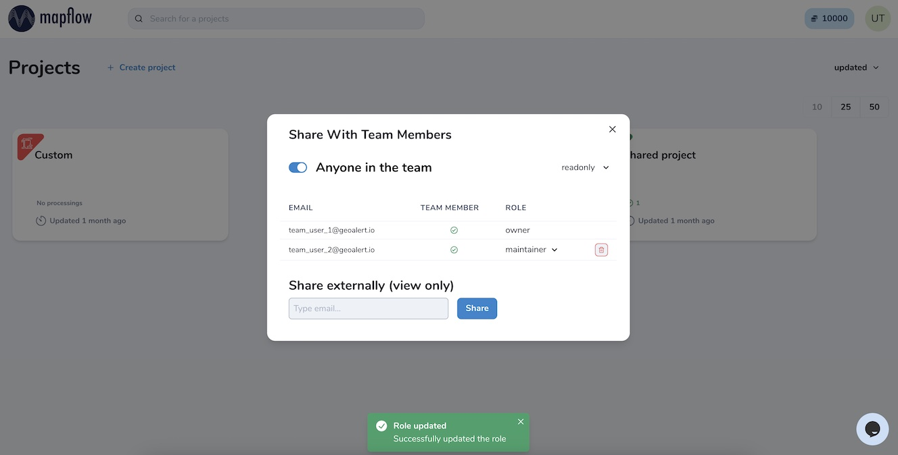

.. _Team accounts:

Team accounts
==============

Users can run a Team account to invite collaborators, share projects and manage Mapflow limits.
Currently, you need to reach out to us to create a Team while we are working on a public UI. Contact us by help@geoalert.io using your corporate email linked to Mapflow account.
Once the Team is created the Owner can invite new members, and assign and manage their limits. Only the Owner gets access to the Team profile.

.. image:: _static/team_accounts.png
   :alt: Preview map
   :align: center
   :width: 15cm
|

.. warning::
   1. The Team creation is currently not enabled for all users – so contact our support to set up a Team.
   2. If the Team member's email is already registered as a Mapflow account, reach out to Support (help@geoalert.io) to ask to link the account.

Project sharing in the Team
----------------------------

You can share your project with anyone in the Team and assign his role as needed. 
Go to *Project --  Share* and invite your specific coworkers or / and activate the option "Anyone in the team".

|

There are four types of the project user's role:

* readonly - can view the project history and the results
* contributor – can run the workflows in the project
* maintainer – can run the workflows, edit the project and share it with users  
* owner – full rights to edit all roles in the project

Your collaborators will see the new shared projects in their dashboard and use them according to the role assigned.

.. note::
    You can share your project with the non-team users for the view-only access. Go to the Project -- Share and enter the Mapflow user's email.